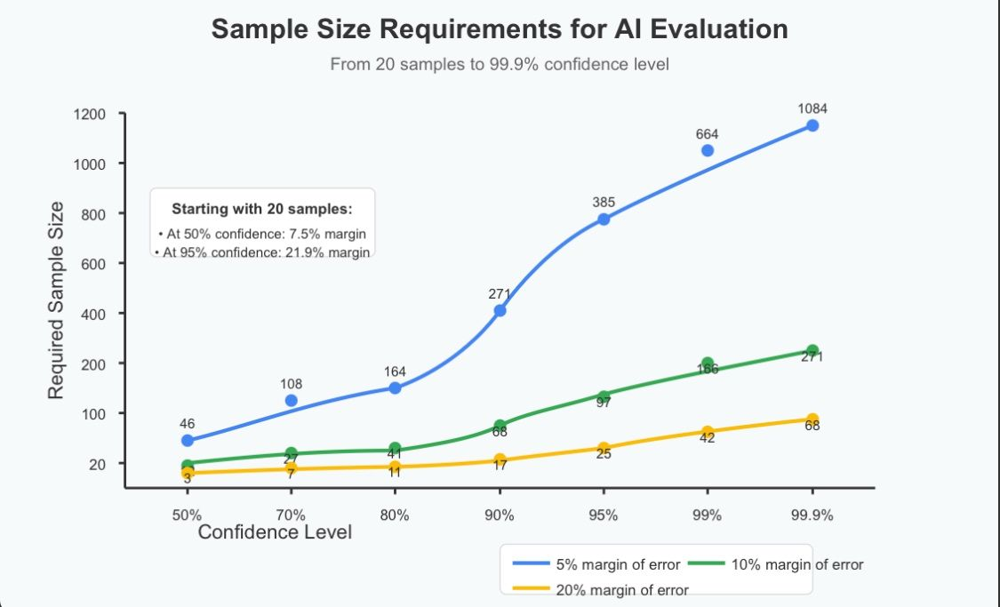

---
authors:
- arianpasquali
categories:
- Applied AI
comments: true
date: 2025-03-30
description: Learn how to determine the required sample size for evaluating AI projects
  to ensure reliable results and informed decisions.
draft: false
slug: evaluation-dataset-sample-size
tags:
- AI evaluation
- sample size
- evaluation framework
- confidence level
- data annotation
---

# How many samples do we need in our evaluation dataset?

The most common question I hear when teams set up their evaluation framework: "How many samples do we need?" 

This question also comes in different forms , like 
"How much time do we need from our domain experts to annotate the dataset?"

In the context of big corporate business, domain experts are usually the most expensive resource in the company. Being able to get one hour of their time is serious money.
So we need to prove how much exactly we need to borrow from their time to annotate our brand new AI project. 

The answer? 
It depends on how much confidence you want in your results.

Statistical significance matters and it matters even more in the context of evaluating generative AI systems. If you're making project decisions based on these evaluations, you need to know they're reliable.

Here's how we frame this question. Let’s consider the confidence level and margin of error we are comfortable with. 3 points to decide:

- The confidence level you require (90%, 95%, 99%)
- The margin of error you can accept
- The expected variance in your data

For example:
- For 90% confidence with ±5% margin of error: ~270 samples
- For 95% confidence with ±5% margin of error: ~385 samples
- For 99% confidence with ±5% margin of error: ~665 samples

These numbers can be calculated using standard statistical formulas for sample size determination.

Remember: Insufficient samples can lead to misleading results and poor decisions about your AI project. Invest in proper evaluation to build trust in your models and your decision-making process.

Even better, quantify how much it will cost in annotation time versus the level of confidence you want to achieve.

