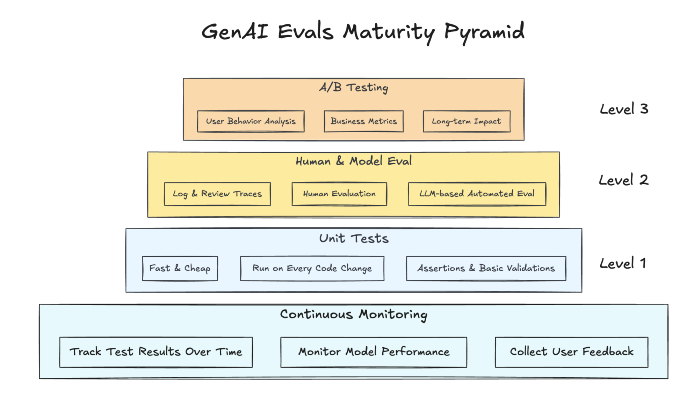
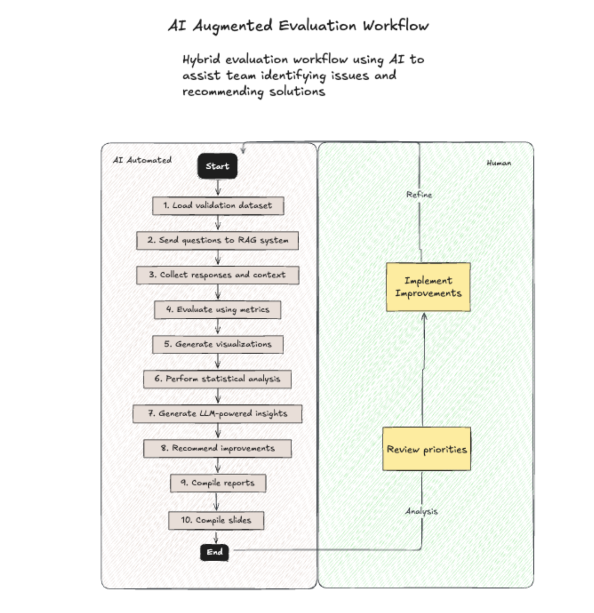
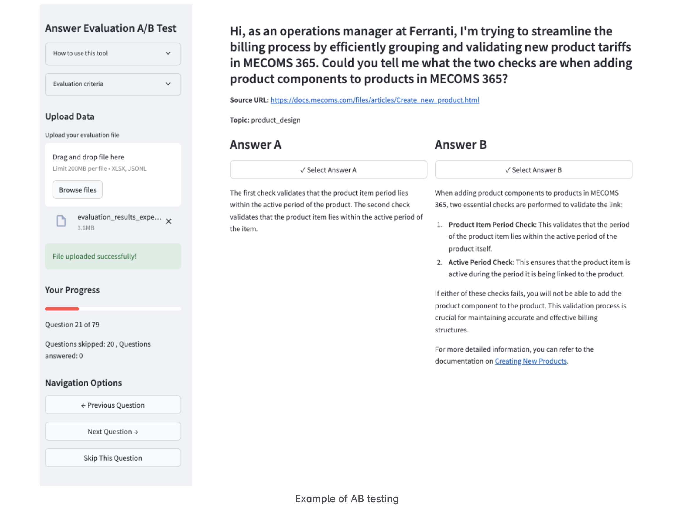

---
authors:
- arianpasquali
categories:
- AI Evaluation
comments: true
date: 2025-05-03
description: Explore my evaluation-driven development approach for generative AI systems,
  focusing on user feedback and continuous improvement.
draft: false
slug: my-evaluation-driven-development-journey
tags:
- AI Development
- User Feedback
- Continuous Improvement
- Evaluation Metrics
- Generative AI
---

# My Journey with Evaluation-Driven Development

Over the past year, I've been working on building generative AI systems that actually solve real problems. What I've learned is that the biggest challenge isn't getting an AI to generate responses—it's ensuring those responses are reliable, useful, and continuously improving based on real user feedback.

This led me to develop what I call an "evaluation-driven development" approach. Instead of building first and evaluating later, I've structured my entire workflow around feedback and evaluation from day one. Here's what I've discovered works.

## The Framework I Use

My evaluation-driven development process consists of seven interconnected phases that I've refined through multiple projects:

**Knowledge Base Understanding**: I start by identifying requirements and assessing data (taxonomy, metadata) to understand the knowledge base segments I'm working with.

**Foundation Building**: Next, I establish a baseline RAG (Retrieval-Augmented Generation) setup as my technical foundation.

**Enhanced Processing**: I implement optimized data processing, search enhancements, response generation, and prompt engineering.

**Observability**: I deploy comprehensive logging, dashboards, monitoring, and user feedback systems to gain visibility into performance.

**Review Evaluation**: My multi-level evaluation includes unit tests, human + model evaluation, and A/B testing to measure effectiveness.

**Optimization**: Based on feedback and prioritization, I analyze data, improve metadata (particularly domain-specific), and review agent architecture.

**Iterative Improvement**: Finally, I implement deployment and monitoring improvements, trace analysis and curation, and integrate data updates.

## Who I Collaborate With

This process has taught me the importance of cross-functional collaboration. I work closely with:

- Product Managers and UX Engineers who focus on interface design
- Domain Experts who provide specialized knowledge  
- Data Engineers who manage infrastructure
- Client Data Engineers who bridge domain and technical needs
- Beta testers and early adopters who provide real-world validation

## My Core Goals

Through this work, I've focused on four key objectives:

1. **Create simple, intuitive UIs** with clear feedback visualization
2. **Aggregate and prioritize user feedback** for targeted iterations
3. **Understand knowledge base segments** for comprehensive coverage
4. **Establish reliable measurement baselines** for ongoing improvements

This systematic approach has transformed my standard observability practices into actionable insights, ensuring my solutions evolve in response to real user needs and quantifiable metrics.

## Phase 1: Understanding the Knowledge Base

**Goal**: Understand KB Segments

This initial phase has become the foundation of my approach. I've learned that comprehensive knowledge base analysis before any implementation is crucial for success.

### What I Focus On:

**Discovery & Requirements**
- Identifying the specific knowledge domains needed for the solution
- Mapping user query patterns to determine information needs
- Documenting domain-specific terminology and concepts

**Data Assessment**
- Taxonomy development to categorize information hierarchically
- Metadata creation to enhance searchability and relationships
- Segmentation of knowledge into functional areas

**Smart Data Ingestion**
- Building custom pipelines that ingest domain-specific data sources
- Creating intelligent metadata automatically
- Preparing baseline content (v0)

I've found that this foundational phase ensures I have properly organized and understood the knowledge segments before proceeding to build the RAG baseline. By thoroughly analyzing the knowledge requirements upfront, I create a more effective foundation for all subsequent phases.

## Phase 2: Foundation Building - RAG Baseline Setup

**Goal**: Setup RAG Baseline

This second phase creates the technical foundation upon which all my subsequent enhancements are built.

### Key Components I Implement:

**Synthetic Testing Framework**
- Utilizing RAGAs and DeepEvals for standardized evaluation
- Implementing synthetic data validation with Argilla or custom UI
- Validating test questions with domain experts to ensure relevance

**Streamlined Testing Approach**
- Implementing simple testing using pytest
- Focusing on basic result generation rather than complex metrics initially
- Using straightforward logging and response analysis techniques

**Experimentation Tracking Infrastructure**
- Setting up MLFlow for systematic experiment management
- Establishing capabilities to track experiment history
- Creating version control for all test configurations

**Automated Evaluation with LLMs**
- Implementing LLM-as-a-Judge evaluation methodology
- Beginning with standard RAGAS metrics as baseline measurements
- Building capabilities to generate evaluation reports and insights

This phase prioritizes creating a solid, measurable foundation rather than advanced features. By establishing clear baselines and testing methodologies, I create a framework that allows for data-driven improvements in subsequent phases.

> **Important Note**: As I've learned from experience and written about in [my post on LLM-as-Judge metrics](llms-as-judges-notes.md), automated metrics are just tools—not absolute truths. The real test is whether these metrics correlate with actual user preferences.

## Phase 3: Observability and User Feedback Analysis

**Goal**: Have a Simple UI and an Overview of User Feedback and Evaluations

This phase focuses on creating accessible interfaces for both users and developers while implementing robust feedback collection and analysis systems.

### What I Build:

**Basic Chat Interface**
- I use Streamlit for rapid development and deployment
- Providing an intuitive, straightforward user experience
- Ensuring accessibility for all stakeholders, including non-technical users

**Integration with Trace Tools**
- Implementing connections to observability platforms like LangSmith, LangFuse, and MLFlow
- Enabling developers to follow the execution path of queries

**Simple User Feedback Mechanisms**
- Implementing thumbs-up/thumbs-down ratings integrated directly in the UI
- Creating seamless integrations with Slack, tracing tools, and databases
- Ensuring high participation rates for continuous feedback collection

**Feedback Aggregation Dashboard**
- Developing dashboards for aggregated user feedback
- Creating visualizations of feedback patterns and trends
- Providing metrics on positive vs. negative feedback ratios

The observability infrastructure I design is lightweight yet comprehensive, capturing both system performance data and user sentiment. By integrating feedback collection directly into the user interface, I ensure high participation rates and create a continuous stream of evaluation data.

## Phase 4: Beyond Observability - Generating Actionable Insights

**Goal**: Aggregate and prioritize user feedback and iterate

This phase is where I transform raw observability data into actionable insights through sophisticated analysis and clustering techniques.

### My Analysis Framework:

**Data Collection Integration**
- Setting up ingestion pipelines from observability tools
- Collecting both structured feedback and unstructured comments
- Capturing user queries with corresponding timestamps and metadata

**Analysis Implementation**
- Developing clustering algorithms to group similar feedback patterns
- Creating categorization systems for user queries by domain and intent
- Implementing automated analysis of response quality metrics

**Insight Generation Systems**
- Building dashboards for visualization of feedback trends and patterns
- Developing recommendation engines to prioritize system improvements
- Establishing automated reporting with actionable next steps

This phase transforms my observability from passive monitoring into a strategic development driver by identifying exactly where improvements will have the greatest impact on user satisfaction and system performance.

## Phase 5: A/B Testing & Evaluation

**Goal**: Validate improvements through controlled experiments

This phase implements controlled experiments to validate improvements and ensure changes positively impact user experience before release.

### My A/B Testing Framework:

**Controlled Experimentation**
- Developing capability to serve multiple response versions simultaneously
- Implementing variant assignment methodology for unbiased testing
- Creating monitoring systems to track performance differences

**Correlation Analysis**
- Establishing systems to monitor correlation between user preferences and LLM-as-a-judge metrics
- Validating that automated evaluation metrics align with actual user satisfaction
- Identifying discrepancies that require metric adjustment

This correlation analysis is crucial—I've experienced firsthand how [LLM-as-judge metrics can diverge from user preferences](llm-as-judge-and-user-preference-correlation.md). In one project, our automated metrics showed only 55% correctness while users preferred our system over 70% of the time. The lesson: always validate your metrics against real user feedback.

**Release Confidence Assessment**
- Defining threshold criteria for determining release readiness
- Implementing statistical significance testing for experimental results
- Creating dashboards for visualizing confidence intervals and performance differences

This phase provides scientific validation of my improvements through controlled experimentation, ensuring that development decisions are based on empirical evidence rather than assumptions.

## The Three-Level Evaluation System I Use

I've developed a comprehensive, multi-level approach that ensures continuous improvement through systematic testing:

**Level 1: Unit Tests**
- **Goal**: Quickly catch obvious issues with minimal resources
- **Process**: Fast, automated tests that run on every code change
- **Characteristics**: Fastest and cheapest, focus on basic assertions, avoid actual LLM calls

**Level 2: Human & Model Evaluation**
- **Goal**: Identify subtle issues and potential improvements
- **Process**: Combined human review with LLM-as-a-Judge evaluation
- **Characteristics**: Log and analyze conversation traces, combines human expertise with automated metrics

**Level 3: A/B Testing**
- **Goal**: Validate user value and business outcomes
- **Process**: Live testing with real users and statistical analysis
- **Characteristics**: Tests with actual users in real scenarios, measures impact on business metrics

## The Continuous Improvement Loop

The entire process I've developed forms a continuous improvement cycle:

1. **Observability** provides raw data and feedback
2. **Review Evaluation** analyzes this data at multiple levels
3. **Optimization** translates insights into targeted improvements
4. **Iterative Improvement** implements changes and updates

## Key Lessons Learned

Through this journey, I've discovered several critical success factors:

- **Commitment to data-driven decision making** - Every improvement needs to be validated
- **Integration of both automated and human evaluation** - Neither alone is sufficient
- **Clear prioritization based on quantifiable metrics** - Focus efforts where they'll have the most impact
- **Continuous experimentation and validation** - Build learning into every release
- **Cross-functional collaboration** - Great AI systems require diverse expertise

### Sample Size Matters for Statistical Confidence

One practical challenge I've encountered is determining how many samples we need for reliable evaluation. As I discuss in [my post about evaluation dataset sample sizes](dataset-samples.md), statistical significance matters immensely. For 95% confidence with ±5% margin of error, you need around 385 samples. This becomes a resource planning question: how much time can you borrow from domain experts for annotation?

### The Enterprise Reality

The broader context here is what I've observed about [enterprise AI adoption](enterprise-ai-adoption-bottleneck.md): the real bottleneck isn't model capability—it's domain-specific evaluation. Most organizations are still between Level 1 and Level 2 AI maturity, using AI as a productivity boost rather than as a true system backbone. Without rigorous evaluation, enterprise trust is impossible.

## Looking Forward

This evaluation-driven approach has fundamentally changed how I build AI systems. Instead of hoping my solutions work well, I now have systematic ways to measure, understand, and improve them based on real user feedback and rigorous testing.

The framework isn't just about building better AI—it's about building AI that gets better over time. And in a field that's evolving as rapidly as generative AI, that continuous improvement capability might be the most valuable feature of all.

If you're building AI systems and struggling with evaluation, I'd encourage you to start with even simple feedback collection. The insights you'll gain from real users interacting with your system will be more valuable than any synthetic benchmark.

As I've written about in [my thoughts on context engineering and evaluation](generative-ai-protocols-and-tartare.md), we're moving beyond prompt engineering to become "context engineers." With solutions like Anthropic's Model Context Protocol standardizing data plumbing, the real differentiator for AI engineers will be building robust evaluation workflows and feedback loops.

## Related Posts

If you found this post helpful, you might also be interested in:

- [My Journey with Evaluation-Driven Development] - My Journey with Evaluation-Driven Development
- [When LLM-as-Judge Metrics and User Preferences Diverge](llm-as-judge-and-user-preference-correlation.md) - Real examples of how automated metrics can mislead
- [LLMs as Judges: Why Automated Metrics Aren't Enough](llms-as-judges-notes.md) - My thoughts on the limitations of LLM-as-judge approaches
- [The Real Bottleneck in Enterprise AI Adoption](enterprise-ai-adoption-bottleneck.md) - Why evaluation, not models, is the limiting factor
- [How Many Samples Do We Need in Our Evaluation Dataset?](dataset-samples.md) - Practical guidance on statistical confidence and sample sizes
- [From Prompt to Context Engineering](generative-ai-protocols-and-tartare.md) - Why evaluation is becoming the key differentiator

What's your experience been with AI evaluation? I'd love to hear about the approaches you've tried and what's worked (or hasn't worked) for your use cases.